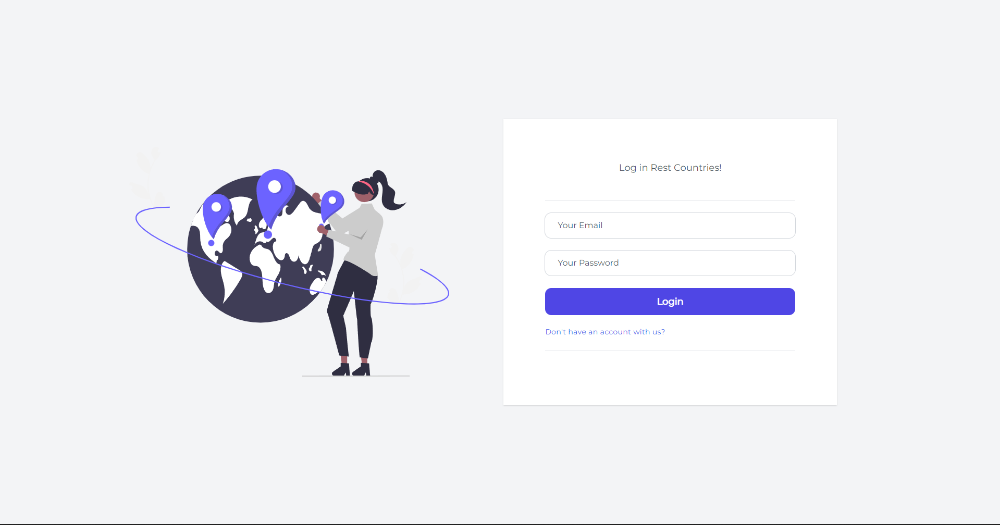
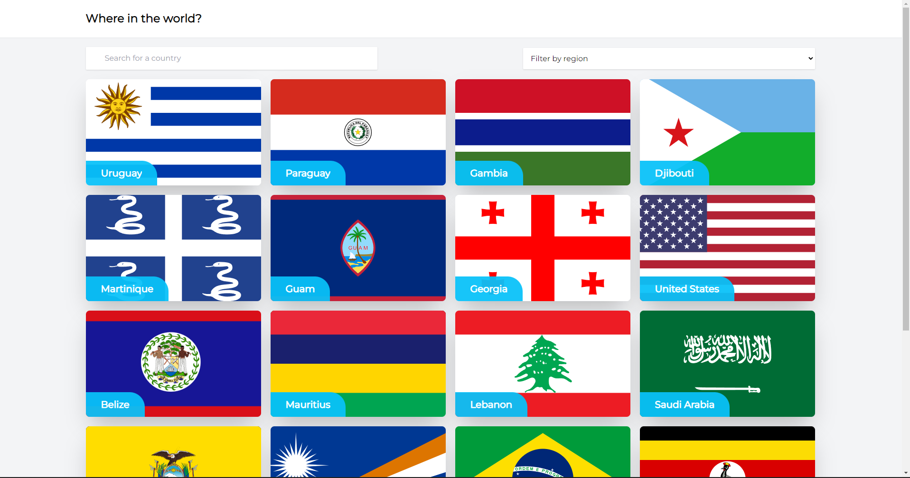
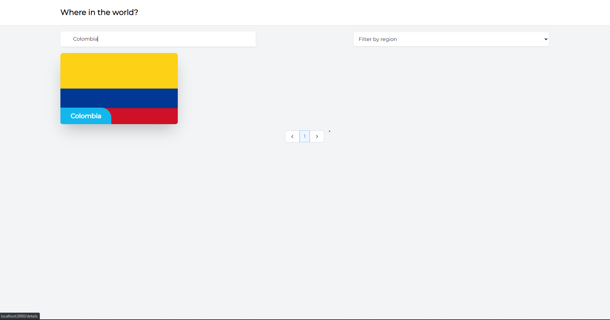
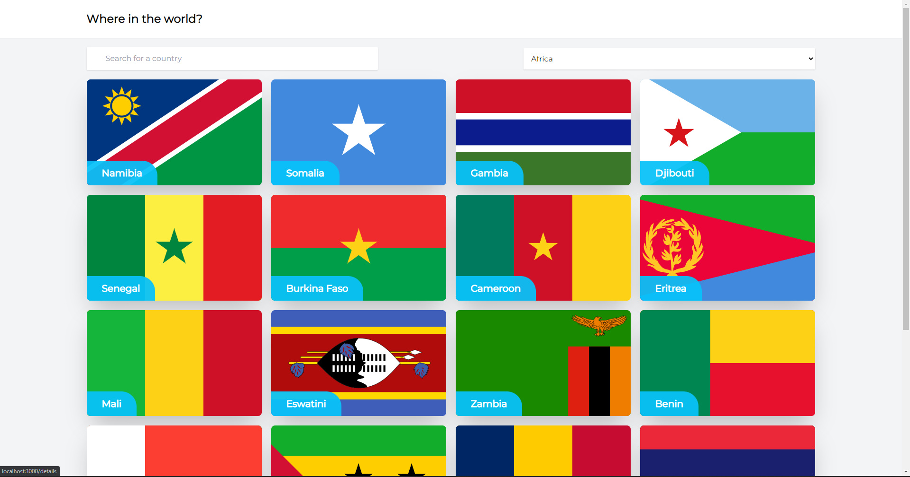
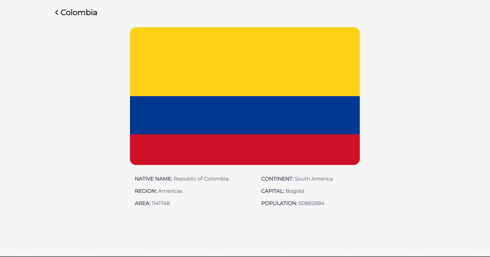

# Rest Countries

Se han usado las siguientes tecnologías para la realización de este proyecto; ViteJs, ReactJS, TailwindCSS, SASS. Todas estas cumplieron un papel demasiado fuerte en el desarrollo de esta aplicación.

Cabe aclarar que la idea original este aplicacion fue basada en esta pagina; [FrontendMentor](https://www.frontendmentor.io/challenges/rest-countries-api-with-color-theme-switcher-5cacc469fec04111f7b848ca)

## Caracteristicas
- ViteJs: Ha sido utilizado para encapsular nuestro proyecto React, Vite es una herramienta creada por Evan You, creador de VueJs, herramienta que nos permite crear proyectos sin ligarlos a algun Framework en concreto.
- ReactJS: Fue utilizado para construir la página web de manera interactiva y responsive.
- Tailwindcss: Me permitió realizar la maquetación de estilos en mi proyecto, aportándome una gran variedad de clases que pude usar.

## Documentación de las tecnologías usadas
-  [Vite](https://vitejs.dev/)
-  [ReactJs](https://es.reactjs.org/)
-  [Tailwindcss](https://tailwindcss.com/docs)

## Instalación del proyecto
- Se requiere tener instalado [Node.js](https://nodejs.org/) v10+.
- Clonar el repositorio con el comando git clone + la ruta del proyecto
- Guía para la instalación de las dependencias para correr el proyecto.
- El proyecto arranca en el puerto 3000

```sh
cd RestCountries
npm i
npm dev
```

## Previsualización del proyecto
- Login: Se realizo por estetica, no esta validado, puedes ingresar con cualquier usuario y contraseña que ingreses.



- Countries: Aqui es donde comienza el projecto, se realizaron los consumos respectivos para mostrar los paises.



- Buscador Countries: Se le implemento un buscador de paises para tener una visualizacion mas facil de los paises, ademas de que se le agrego una paginacion al final de esta page.



- Filtro Countries: Se le implemento un filtrado de regiones para tener una visualizacion mas facil de los paises.



- Descripcion Countries: Se implemento la descripcion de cada uno de los paises con los datos solicitados a mostrar.


